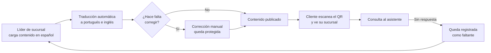

# Portal de Clientes

**Estado: Listo para usar.** Los líderes de sucursal ya pueden cargar imágenes, lugares de turismo y toda la información útil para las sucursales de cada provincia.

---

## Resumen

El Portal de Clientes es una web pública, pensada primero para el celular, que el cliente de Localiza Argentina abre **escaneando el QR de la sucursal** después de retirar el auto. No crea una cuenta ni inicia sesión: el QR lo lleva directo al contenido de *su* sucursal.

Ahí encuentra lugares para visitar, consejos de manejo y de viaje para la zona, videos instructivos (cómo cambiar una rueda, cómo poner cadenas, cómo usar el matafuegos), qué significa cada luz del tablero, un asistente para hacer consultas y un botón grande para llamar a asistencia 24 h. Todo en **español, portugués e inglés**.

Detrás hay un **panel de administración** dentro de la app interna de Localiza. Desde ahí se gestionan las sucursales, sus QR, el contenido, las imágenes y las traducciones.

## Problema que resuelve

- **El cliente se va del mostrador con dudas.** Qué visitar, cómo son las rutas de la zona, qué hacer si se prende una luz, a quién llamar si pasa algo. Esas preguntas terminaban en llamadas a la sucursal o se quedaban sin respuesta.
- **Cada sucursal es distinta.** El turismo de una ciudad de montaña no tiene nada que ver con el de un aeropuerto. Un folleto genérico no le sirve a nadie.
- **Muchos clientes no hablan español.** Una parte importante del público es turista de Brasil o de otros países, y el contenido tiene que llegarles en su idioma.
- **El portal anterior era un sistema aparte.** Era una aplicación separada, con su propia base y su propio mantenimiento, y las traducciones se cargaban a mano campo por campo.

## Qué hace

### Para el cliente (portal público)

| Sección | Qué encuentra |
|---|---|
| **Turismo** | Lugares recomendados de la sucursal, agrupados por categoría (imperdibles, gastronomía, vida nocturna, compras, en familia, escapadas, lugares para fotos, eventos), con zona, horario, teléfono, puntaje, foto y botón "Cómo llegar" cuando el lugar tiene dirección. |
| **Recomendaciones** | Consejos de manejo y viaje propios de la zona: rutas y accesos, velocidad y multas, estacionamiento, clima, fauna en la ruta, manejo del vehículo, trámites y peajes, seguridad. |
| **Mecánica** | Videos instructivos de seguridad, iguales para todas las sucursales, y una guía de **luces del tablero** que explica qué significa cada una. Si la sucursal no tiene nieve, no se le ofrece la guía de cadenas. |
| **GPS** | Por qué se recomienda Waze y un botón que abre la app (o la tienda, si no está instalada). |
| **Información útil y preguntas frecuentes** | Requisitos para retirar el vehículo, contacto y las dudas más comunes (combustible, devolución en otra sucursal, desperfectos). |
| **Asistente** | Un chat donde el cliente escribe su pregunta y recibe respuestas armadas **sólo con el contenido ya cargado** para su sucursal. |
| **SOS** | Primero una acción grande e inequívoca (llamar a asistencia 24 h) y después los números de emergencia. Pensado para el peor momento, con el celular en una mano. |

El cliente elige el idioma (ES / PT / EN). Si el QR no es válido o entra sin QR, el portal le muestra un selector de sucursales en lugar de un error.

### Para quien administra el contenido (panel interno)

| Pestaña | Para qué sirve |
|---|---|
| **Resumen** | Cuánto contenido hay cargado y, sobre todo, las **consultas sin respuesta**: lo que los clientes buscaron en el asistente y no encontraron. |
| **Sucursales** | Alta, edición y baja de sucursales. Cada una tiene su propio QR, que se imprime o se descarga como imagen. |
| **Turismo** | Carga de lugares por sucursal. Sólo título y descripción son obligatorios; el resto de la ficha es opcional. |
| **Recomendaciones** | Consejos por sucursal, con categoría y orden. |
| **Videos** | Links de YouTube: los de **Mecánica** (comunes a todas las sucursales) y los de **Turismo** (por sucursal). |
| **Imágenes** | Fondo de cada sucursal, portada grande de Turismo y una portada por categoría. |
| **Traducciones** | Lo pendiente de traducir, traducción automática en un click y corrección manual por idioma. |
| **Asistente** | El historial de consultas, con un filtro para ver sólo las que quedaron sin respuesta. |
| **Ajustes** | Nombre del portal, texto de bienvenida en los tres idiomas y teléfono de asistencia 24 h. |

## Cómo funciona el proceso

### 1. Alta de la sucursal y su QR

1. Un administrador da de alta la sucursal en **Sucursales**. El sistema le genera un identificador único que viaja dentro del QR.
2. Desde la misma fila se imprime el QR (sale con el nombre de la sucursal) o se descarga como imagen, para pegarlo en los autos o en el mostrador.
3. El QR **no vence**. Si hace falta invalidarlo, se rota el identificador: los QR viejos dejan de funcionar en el momento y hay que imprimir los nuevos. Como es una acción con impacto, para confirmarla se pide escribir el nombre exacto de la sucursal.
4. Eliminar una sucursal borra todo su contenido (turismo, recomendaciones y videos de turismo) y no se puede deshacer.

### 2. Carga de contenido

1. El líder de sucursal entra al panel y elige su sucursal en el selector que está arriba de cada pestaña.
2. Carga los **lugares de turismo**: título, descripción y, si quiere, categoría, dirección (de ahí sale el botón "Cómo llegar"), zona, horario y una nota a destacar. La foto se agrega una vez que el lugar ya existe.
3. Carga las **recomendaciones** de manejo y viaje de la zona, con su categoría y su orden.
4. Suma **videos de turismo** de la sucursal. Los de mecánica son comunes y se cargan una sola vez para todas.
5. Sube las **imágenes**: el fondo de la sucursal y las portadas de Turismo.
6. Con **Ir al portal** abre el portal público en otra pestaña y lo ve tal como lo va a ver el cliente.

El contenido se publica al guardar: no hay un paso de aprobación aparte.

### 3. Idiomas

1. Todo se carga **en español**, que es el original.
2. En **Traducciones** se ve qué quedó pendiente y se traduce todo de una vez a portugués e inglés con un modelo de lenguaje, instruido para **no traducir nombres propios** (lugares, aeropuertos, marcas). Un traductor genérico los traduce igual y deja textos que después no coinciden con los carteles de la calle.
3. Cualquier traducción se puede **corregir a mano**. Una corrección manual queda **blindada**: la traducción automática nunca la vuelve a pisar.
4. Si se edita un campo traducible (por ejemplo, la descripción de un lugar), sus traducciones viejas se descartan y el ítem vuelve a pendientes. Así nunca queda publicada una traducción que ya no corresponde al original. La pantalla lo avisa.
5. Si la traducción automática no está disponible, el portal sigue funcionando: se guarda en español y las traducciones se cargan a mano.

### 4. El ciclo de mejora

El asistente del portal **no inventa respuestas**: busca únicamente en lo que ya está cargado (turismo, recomendaciones, mecánica, luces, GPS, SOS e información útil). Entiende preguntas escritas en cualquiera de los tres idiomas, sin importar cuál eligió el cliente en el portal.

Cada consulta que no encuentra nada queda registrada como **sin respuesta**. Esa lista es, literalmente, la lista de lo que falta cargar: el líder la revisa en **Resumen** o en **Asistente** y completa el contenido en la pestaña que corresponda.

## Roles y permisos

- **Cliente:** no tiene cuenta. Lo único que lo identifica es el QR de la sucursal, que define *qué* contenido ve, no *si* lo ve. Todo lo que muestra el portal es contenido editorial público, así que un QR compartido no expone datos de nadie.
- **Quien mantiene el contenido:** necesita el permiso de módulo **Portal de Clientes** dentro de la app interna. No viene incluido por defecto en ningún puesto operativo: lo tienen los administradores y quien lo reciba explícitamente (marketing y los líderes de sucursal que cargan el contenido).
- **Administradores:** otorgan ese permiso desde la gestión de usuarios de la app.

## Arquitectura a alto nivel

- **Backend:** Python con FastAPI. El portal tiene **dos superficies separadas**:
  - una **pública**, sin sesión, que sólo sirve contenido de lectura y el chat, con límites de uso para evitar abusos;
  - una **administrativa**, que exige sesión y el permiso del módulo, y es la única que puede modificar contenido.
- **Frontend:** Next.js (React) con Tailwind. El portal público y el panel son pantallas distintas de la misma aplicación; el portal tiene su propia dirección y su propia identidad visual, sin nada de la navegación interna.
- **Contenido:** el español es el original; las traducciones se guardan aparte, por campo e idioma, marcando cuáles fueron corregidas a mano.
- **Traducción:** un modelo de lenguaje, que se invoca sólo desde el panel y sólo sobre lo pendiente. Es opcional: sin él, el sistema funciona igual.
- **Asistente:** reglas y búsqueda sobre el contenido cargado, **sin IA generativa**. Eso garantiza que nunca responda algo que no esté publicado.

## Por qué es mejor que lo anterior

| Antes | Ahora |
|---|---|
| Una aplicación separada, con su propia base y su propio mantenimiento. | Integrado a la app interna de Localiza: mismo login, mismos permisos, mismo despliegue. |
| Traducciones cargadas a mano, campo por campo. | Traducción automática en un click, con corrección manual protegida. |
| Una traducción vieja podía quedar desfasada del original. | Editar el original invalida sus traducciones y las vuelve a poner en pendientes. |
| Sin forma simple de ver qué buscaban los clientes. | Las consultas sin respuesta muestran exactamente qué contenido falta. |
| Arrastraba secciones que ya no se usaban. | La migración las dejó afuera y ordenó el portal alrededor de lo que el cliente necesita en la ruta. |

## Estado y próximos pasos

**Estado actual:** listo para usar. El portal público, el panel de administración, los QR por sucursal, la traducción a portugués e inglés y el asistente están funcionando.

**Próximo paso:** que los líderes de sucursal de cada provincia carguen su contenido —imágenes, lugares de turismo, recomendaciones de la zona y videos— y que usen las consultas sin respuesta del asistente como guía de qué completar primero.
