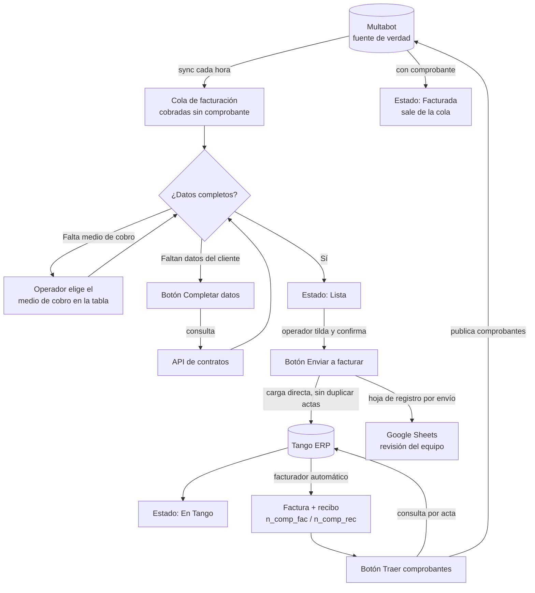

# Facturación automática de multas

**Estado: En producción** · Localiza Argentina (rent a car) · Módulo de Infracciones de la app interna

---

## Resumen

Cuando un cliente de Localiza comete una infracción de tránsito con un auto alquilado, la multa
le llega a la empresa, que la paga y después se la cobra al cliente. Ese cobro tiene que terminar
en una **factura en el ERP (Tango)**, con su comprobante registrado también en el sistema donde
viven las multas (**Multabot**).

Antes, ese camino pasaba por planillas de Google, flujos de n8n e importaciones y cargas a mano.
Hoy lo resuelve una pantalla de la app interna con tres botones:

1. **Completar datos**: trae del contrato los datos del cliente que falten.
2. **Enviar a facturar**: sube las multas listas directo a Tango y deja una planilla de registro
   para que el equipo revise.
3. **Traer comprobantes**: consulta en Tango qué multas ya tienen factura y recibo, y los publica
   en Multabot.

Lo único que todavía se carga a mano en varios casos es el **medio de cobro**.

---

## Contexto

### Qué es una multa en un rent a car

El auto está a nombre de Localiza, así que las actas de las jurisdicciones (municipios,
provincias, rutas) llegan a la empresa aunque el que manejaba fuera el cliente. Multabot, un
proveedor externo, escanea las jurisdicciones por patente para todos los autos activos de la
flota y guarda cada multa. **Multabot es la fuente de verdad**: la app trabaja sobre un espejo
que se sincroniza cada hora y escribe en Multabot por su API.

### Quién paga y por qué hay que facturar

Una multa tiene dos puntas de plata, y son procesos distintos:

- **Pago**: Localiza le paga la multa a la jurisdicción (lo gestiona Tesorería).
- **Cobranza**: Localiza le cobra al cliente la multa, más un cargo administrativo y el IVA
  correspondiente a ese cargo.

Lo que se le cobra al cliente es un ingreso y tiene que documentarse con una **factura y un
recibo** emitidos en Tango. Este proyecto cubre ese último tramo de la cobranza: **de la multa
cobrada al comprobante emitido y registrado**.

> El módulo de Infracciones tiene más pantallas (tablero, indicadores, cobranza, vinculación de
> multas con contratos, egresos y pago a jurisdicciones, facturación corporativa). Acá sólo se
> describe la facturación de las multas cobradas a clientes particulares; el circuito
> corporativo, donde se le factura a la empresa, va por otro lado.

### Dos campos que hay que entender

Cuando Tango factura, asigna dos números de comprobante:

- **`n_comp_fac`**: el número de la **factura**.
- **`n_comp_rec`**: el número del **recibo**.

En Multabot, esos números se guardan en dos campos de la multa. **Que esos campos tengan un valor
es lo que marca a una multa como "ya facturada"**. Por eso es clave que ahí haya sólo
comprobantes reales.

---

## El proceso antes

- Las multas cobradas se volcaban a una **planilla de Google** y una cadena de flujos de **n8n**
  leía la planilla, la transformaba y la cargaba en Tango.
- Los datos del cliente que faltaban se buscaban a mano.
- Una vez facturadas, los números de factura y recibo se **cargaban a mano en Multabot**, multa
  por multa.
- El equipo usaba los mismos campos de comprobante para anotar el estado del trámite ("enviado",
  "esperando orden de compra"). Como cualquier texto ahí cuenta como "ya facturada", **esas notas
  escondían multas que en realidad no estaban facturadas**. Se limpiaron cuando se armó el módulo
  nuevo.
- El flujo de n8n armaba la carga a Tango concatenando texto, algo frágil ante datos con
  caracteres especiales.

---

## El proceso ahora, paso a paso

### 0. Entrada: la cola de multas a facturar

La pantalla de Facturación muestra todas las multas **cobradas al cliente y todavía sin
facturar**, de todo el histórico. Para entrar a la cola, una multa tiene que cumplir las cuatro
condiciones a la vez:

1. Estar marcada como **cobrada**.
2. No tener todavía comprobante de factura ni de recibo.
3. Estar vinculada a un **contrato real** (no a marcas como "movimiento interno" o "no cobrar").
4. Tener un **monto cobrado** mayor a cero.

Las que quedan afuera no desaparecen: se muestran como **"Fuera del circuito"** con el motivo,
para que un "no hay nada para facturar" siempre tenga explicación.

El período a facturar se mira por **fecha de cobro**, no por fecha de la infracción: una multa
de marzo cobrada en agosto se factura en agosto.

**Importes.** Todo sale del monto realmente cobrado: el total se descompone en multa, cargo
administrativo (el porcentaje del acta, o uno por defecto si no figura) e IVA sobre el cargo, de
forma que las tres partes suman exacto el total.

### 1. Revisión de datos y medio de cobro (equipo de multas)

Cada fila tiene un estado. Una fila está **Pendiente** si le falta el medio de cobro o algún
dato del contrato, y la tabla dice qué falta.

- **Medio de cobro.** Multabot lo informa como texto; la app lo traduce a la cuenta de Tango
  **sin adivinar**: sólo acepta valores de un catálogo cerrado (Mercado Pago, banco, tarjetas de
  crédito y débito, etc.). Si no lo reconoce, la fila queda pendiente y el operador lo elige en
  una lista desplegable dentro de la tabla. **Este es hoy el principal paso manual.**
- **Botón "Completar datos".** Si faltan datos del cliente o del conductor (contrato no
  descargado, documento faltante), el botón consulta la **API de contratos** de Localiza y los
  completa. Trabaja en lotes chicos para no sobrecargar esa API: si quedan pendientes, se vuelve
  a apretar.

Cuando una fila tiene todo, pasa a **Lista**.

### 2. Botón "Enviar a facturar" (equipo de multas → Tango + Google Sheets)

- El operador tilda las multas **Listas** que quiere enviar (sólo se pueden tildar las listas) y
  confirma.
- La app **sube las filas directo a Tango**, a la tabla de entrada que lee el facturador
  automático del ERP. Sin planilla intermedia ni n8n.
- La carga tiene un **control de duplicados por número de acta**: si una multa ya estaba en
  Tango, no se vuelve a subir y el resultado lo informa.
- Después de subir, la app **crea una hoja en Google Sheets** con lo que se envió (una pestaña
  por envío, con fecha y hora), para la **revisión manual del equipo de multas**.
- Las multas enviadas pasan a **En Tango**: ya están en el ERP, falta que se les asigne el
  comprobante.

### 3. Tango factura

El facturador automático de Tango toma las filas y emite factura y recibo, asignando
`n_comp_fac` y `n_comp_rec`.

### 4. Botón "Traer comprobantes" (equipo de multas → Tango → Multabot)

- La app consulta en Tango, por número de acta, si ya se asignaron `n_comp_fac` y `n_comp_rec`.
- Los que ya tienen comprobante se **publican en Multabot** en los campos de factura y recibo,
  sin que nadie los tipee. Cada comprobante se publica una sola vez.
- Esas multas pasan a **Facturadas** y salen solas de la cola. Las que siguen sin comprobante
  quedan **En Tango** hasta la próxima consulta.

---

## Diagrama del flujo

---

## Estados de una multa en facturación

| Estado | Qué significa |
|---|---|
| **Pendiente** | Falta el medio de cobro o algún dato del contrato. La fila dice qué falta. |
| **Lista** | Tiene todo; se puede tildar y enviar. |
| **En Tango** | Ya se cargó en el ERP; falta que Tango asigne el comprobante. |
| **Facturada** | Tiene factura y recibo, publicados en Multabot. Sale de la cola. |
| **Exportada** | Sólo existe en el modo manual de respaldo (ver abajo): la planilla se armó pero todavía nadie la importó en Tango. |

En la pantalla, cada estado es una tarjeta con su conteo que además filtra la tabla.

---

## Controles y revisión manual

- **Confirmación antes de enviar.** "Enviar a facturar" muestra cuántas multas y qué importe se
  van a subir, y pide confirmar. Sólo se envía lo que el operador tildó.
- **Sin duplicados.** La carga a Tango no repite un acta que ya esté en el ERP.
- **Hoja de registro.** Cada envío deja su pestaña en Google Sheets con lo que se subió, para el
  doble control del equipo. Es un registro, no un paso previo: si la hoja fallara, las multas
  igual quedan bien marcadas como enviadas, porque ya están en Tango.
- **La multa sale de la cola sólo con un comprobante real.** "En Tango" no alcanza: hasta que
  aparece la factura, la fila sigue a la vista.
- **El medio de cobro no se adivina.** Un valor que no está en el catálogo queda pendiente en vez
  de facturarse con una cuenta equivocada. Una vez enviada la multa, el medio de cobro queda fijo.
- **"Fuera del circuito" con motivo.** Lo que no entra a la cola se cuenta y se explica.
- **Carga segura.** La subida a Tango usa parámetros en lugar de armar texto a mano, así que un
  nombre con comillas no rompe nada.
- **Vuelta atrás sin tocar código.** El destino del envío se elige por configuración: carga
  directa a Tango (lo normal), planilla para importar a mano, descarga en Excel o apagado. Pasar
  de un modo a otro es un cambio de configuración y un reinicio.
- **Exportar Excel.** Siempre se puede bajar la grilla completa para revisarla afuera.

---

## Por qué es mejor

- **Menos pasos a mano.** Los datos del cliente se completan solos y los comprobantes viajan
  solos de Tango a Multabot: se terminó el tipeo de números de factura y recibo.
- **Menos intermediarios.** Se sacaron del medio la planilla de carga y la cadena de n8n; la app
  habla directo con Tango.
- **Estado confiable.** Los campos de comprobante en Multabot sólo tienen comprobantes reales,
  así que ninguna multa queda escondida por una nota de seguimiento.
- **Visibilidad.** Una sola pantalla muestra qué falta, qué está listo, qué está en Tango y qué
  ya se facturó, filtrable por fecha de cobro.
- **Trazabilidad.** Cada envío queda registrado en una hoja con fecha y hora.

---

## Lo que falta y próximos pasos

- **Medios de cobro manuales.** Hoy todavía se ingresan a mano varios medios de cobro: los que no
  llegan desde Multabot o llegan con un texto fuera del catálogo. Es el principal paso manual que
  queda en el circuito.
- **Envío diario automático.** La carga a Tango hoy se dispara con el botón. Hacerla sola, todos
  los días, es una decisión aparte, preparada para activarse por configuración.
- **Supuestos frágiles.** El catálogo de medios de cobro está fijo en el código, y el porcentaje
  de cargo administrativo por defecto se usa cuando el acta no lo trae; un acta con otro
  porcentaje y sin ese dato se repartiría mal entre multa, cargo e IVA.
- **Notificación al conductor.** El módulo tiene una segunda pestaña, construida, para mandarle a
  cada conductor el PDF de su factura por mail, con envío en tandas, reintentos y modo
  simulación. Su puesta en marcha es una etapa aparte de lo que describe este documento.
