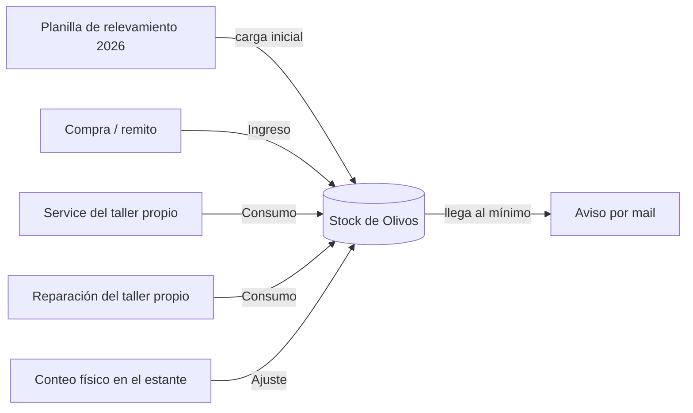

# Taller · Stock de repuestos

**Estado:** En construcción (todavía no está en uso)

## Resumen

Un inventario de repuestos del taller propio de Olivos dentro de la app de gestión de flota. Muestra cuánto hay de cada repuesto, qué está por agotarse y qué entró o salió, con el historial de cada movimiento. Arranca con el stock relevado a mano en la planilla 2026. La idea es que cada service y cada reparación del taller descuenten lo que usan, sin cargar nada dos veces.

## El problema: la planilla

- El stock del taller se lleva en una planilla, separada de la app donde se cargan los services y las reparaciones. Mantenerla al día depende de que alguien se acuerde de actualizarla.
- Una planilla no explica **por qué** cambió un número: si fue un service, una reparación, una compra o una corrección.
- No avisa cuando algo se está terminando.
- Lo que se usa en un auto queda registrado en un lado y el stock en otro.

## Qué hace

- **Indicadores arriba:** cuántos repuestos están bajo el mínimo, cuántos están sin stock y el total de unidades.
- **Tabla agrupada por ítem** (por ejemplo, todos los filtros de aceite juntos) con buscador por marca, modelo o auto, y un filtro para ver sólo lo que hay que reponer.
- **Semáforo por repuesto:**

  | Estado | Cuándo |
  |---|---|
  | OK | Hay más unidades que el mínimo |
  | Bajo | Llegó al mínimo o está por debajo |
  | Sin stock | No queda ninguna unidad |

- **Panel lateral por repuesto:** al tocar una fila se abre el detalle con el saldo, el mínimo y el historial de movimientos (qué entró, qué salió, para qué auto, quién lo cargó y cuándo).
- **Tres acciones desde el panel:** ingreso, ajuste por conteo físico y cambio del stock mínimo.
- **Alta de repuestos nuevos**, colgados de un ítem del catálogo del taller.
- **Kit de service:** una tarjeta para definir qué ítems forman el kit.

## Cómo funciona el proceso

### Ingreso

Cuando llega mercadería se registra un ingreso: cantidad, y opcionalmente costo unitario y una referencia (remito o factura). El saldo sube y el movimiento queda en el historial.

### Consumo

El repuesto sale cuando se usa en un auto. El diseño ata cada consumo a su **origen** (un service o una reparación concretos) y a la **patente** del auto. Eso permite tres cosas:

- **Cargar dos veces no descuenta dos veces.** El sistema compara lo que ese service o esa reparación deberían haber consumido con lo que ya se descontó, y sólo registra la diferencia.
- **Editar mueve sólo lo que cambió.** Si se corrige un service y se saca un ítem, ese repuesto vuelve al stock con un movimiento de reversa.
- **Anular devuelve todo** lo que ese origen había consumido.

Para elegir qué repuesto concreto se descuenta, el sistema propone primero los compatibles con el modelo del auto y, entre ellos, el que más stock tiene. Quien carga puede elegir otro.

Lo cargado antes de la fecha de arranque del stock no descuenta: el inventario inicial ya refleja esos consumos.

### Ajuste por conteo físico

Cuando alguien cuenta el estante y el número no coincide, carga **lo que contó**, no la diferencia. El sistema calcula el ajuste solo y exige un motivo. Así el historial explica cada salto del saldo.

### Stock mínimo

Cada repuesto tiene su mínimo (hay uno por defecto y se puede cambiar). Al llegar a ese número pasa a "Bajo" en el semáforo y se manda un aviso por mail. El mail sale después de guardar: si falla, no frena ni revierte la carga del service.

### Kit de service por modelo

Un service completo usa siempre el mismo conjunto de ítems. En vez de descontar cada uno por separado, se puede definir un **Kit de Service**, que se arma por modelo de auto:

- Si un service lleva **todos** los ítems del kit, descuenta **un kit** del modelo de ese auto.
- Si le falta alguno, descuenta ítem por ítem.
- La composición del kit se edita desde la pantalla. Si se deja vacía, no hay kit y todo va ítem por ítem.

### Stock inicial

El saldo de arranque sale de la planilla de relevamiento 2026 del taller. Se importó una sola vez y quedó registrado como movimiento de importación, así que también se ve en el historial.

## Modelo conceptual

| Concepto | Qué es |
|---|---|
| **Ítem** | Lo que se carga en un service o una reparación ("Filtro de aceite"). Vive en el catálogo del taller. |
| **Repuesto** | Lo que sale del estante: tipo, marca, modelo y a qué autos sirve. Un ítem puede tener varios repuestos. Tiene saldo, mínimo y puede desactivarse. |
| **Movimiento** | Cada cambio del saldo: ingreso, consumo, reversa o ajuste. Guarda cantidad con signo, origen, patente, costo, motivo, quién y cuándo. |
| **Kit de Service** | Una unidad de stock que reemplaza a un grupo de ítems cuando un service los lleva todos. Hay un kit por modelo. |

Decisiones de diseño:

- **Se controla el repuesto concreto, no el ítem genérico.** "Filtro de aceite" no alcanza: lo que importa es qué filtro, de qué marca y para qué autos.
- **El repuesto se engancha al ítem por su nombre normalizado, no por un identificador interno.** Renombrar un ítem en el catálogo no rompe el stock.
- **El saldo puede quedar negativo.** Es una señal de que se usó algo que no estaba cargado; se corrige con un ajuste.

Hay un único depósito: Olivos. Lo que se hace en talleres externos no se maneja acá.

## Roles

- **Quien tiene acceso a Taller** gestiona el stock: registra ingresos, ajustes, mínimos, repuestos nuevos y el kit.
- **Administración** sólo lee: ve saldos e historial, sin poder modificar.

El permiso es por módulo y por usuario, igual que el resto de la app.

## Por qué es mejor

- **Un solo lugar.** El stock vive al lado de los services y las reparaciones, no en un archivo aparte.
- **Cada número tiene explicación.** Todo cambio de saldo es un movimiento con motivo, auto y responsable.
- **Avisa antes de que falte.** El semáforo y el mail de mínimo cambian el "no hay" por "se está terminando".
- **El conteo físico es simple.** Se carga lo que se ve en el estante; la cuenta la hace el sistema.
- **No duplica.** Re-guardar o editar un service no descuenta de más.

## En curso y próximos pasos

- **Descuento automático en todo el circuito (en curso).** Que todos los cambios que se hagan en una franquicia, una reparación o un service se descuenten automáticamente del stock, incluida la facturación.
- **Puesta en uso.** Empezar a operar el stock en el día a día del taller.

## Stack

FastAPI + Next.js, dentro de la app de gestión de flota de Localiza Argentina.
