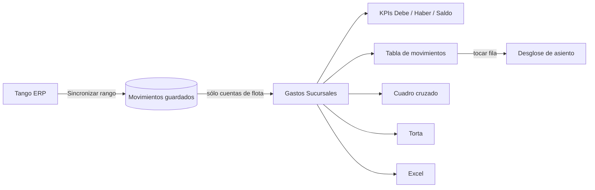

# Taller · Gastos Sucursales

**Estado:** Propuesta de mejora

## Resumen

Una vista dentro del módulo Taller que muestra, a partir de la contabilidad de Tango ERP, cuánto se gastó en la flota por sucursal y por patente. La pantalla ya existe y funciona, pero está pensada con lógica de contador: muchos filtros, columnas contables y tres formas distintas de ver el mismo total. Este documento describe cómo funciona hoy y propone simplificarla con el mismo formato que la pantalla de Stock de repuestos.

## Para qué sirve

- Saber **cuánto gastó cada sucursal** en la flota en un período.
- Bajar al detalle de **un auto en particular**: qué gastos tiene imputados y de qué proveedor.
- Ver un **asiento contable** completo cuando un número no cierra.
- Sacar la información a **Excel** para trabajarla afuera.

## Cómo funciona hoy

### De dónde salen los datos

- Tango ERP guarda cada movimiento contable con un **auxiliar** (la sucursal o el centro de costos) y un **subauxiliar**, que en la mayoría de los casos es la **patente** del auto. Eso es lo que permite mirar el gasto por auto.
- La pantalla no muestra todo el plan de cuentas: sólo las **cuentas de flota** que el área pidió mirar. El resto se guarda igual; el recorte es de lectura, así que sumar o sacar una cuenta no obliga a volver a sincronizar.
- El filtro de cuentas es por código, no por descripción: si alguien renombra una cuenta en Tango, no desaparece de la pantalla sin aviso.

### Sincronización

- Un botón **Sincronizar** trae de Tango los movimientos del rango elegido. La extracción es directa contra Tango, por partes, para no cargar toda la información en memoria de una vez.
- Si la sincronización falla, la pantalla muestra el motivo real en vez de un "falló" genérico.
- Los datos se guardan localmente con reemplazo por movimiento: sincronizar dos veces el mismo rango no duplica.

### Qué muestra

- **Rango de fechas:** por defecto los últimos 90 días, con atajos ("Este mes", etc.). El rango queda en el link, así que se puede compartir la misma vista.
- **KPIs:** Debe, Haber y Saldo del período.
- **Filtros de la barra:** tipo de auxiliar, auxiliar, cuenta contable, módulo de origen (Contable, Compras, Ventas, Tesorería), búsqueda por patente y por proveedor, y un tilde "Solo patentes".
- **Tabla de movimientos** de 11 columnas: mes, módulo, tipo de auxiliar, auxiliar, patente, proveedor, factura, cuenta, debe, haber y saldo. Ordenable, con filtros por columna.
- **Cuadro cruzado** auxiliar × cuenta contable.
- **Torta** con la distribución del saldo entre los auxiliares principales (el resto se agrupa en "Otros").
- **Desglose de asiento:** al tocar un movimiento se abre un panel lateral con todos los renglones del asiento que lo originó.
- **Exportar a Excel** con los filtros aplicados.



## Problemas de uso

- **Habla en idioma contable.** Debe, Haber, Saldo, auxiliar, subauxiliar, cuenta contable. Quien opera la flota quiere saber "cuánto se gastó y dónde", no leer un mayor.
- **Demasiados filtros a la vista.** Seis controles en la barra más una fila de filtros por columna. La pregunta más común (¿cuánto gastó esta sucursal?) queda enterrada.
- **Los filtros por columna confunden.** Corren sólo sobre la página de movimientos ya cargada, no sobre todo el período. Resultado: el total del pie de la tabla puede no coincidir con los KPIs de arriba, y no hay forma de darse cuenta mirando la pantalla.
- **Tres vistas del mismo dato.** KPIs, cuadro cruzado y torta compiten por la atención y obligan a decidir cuál mirar.
- **No hay un punto de entrada por sucursal.** Para ver una sucursal hay que filtrarla, en lugar de elegirla de una lista.
- **Viene de otra área.** La pantalla era una pestaña de Administración y se movió a Taller conservando su forma original, pensada para ese público.

## La propuesta

Mismo esqueleto que **Stock de repuestos**: indicadores arriba, una lista agrupada con buscador y un panel lateral con el detalle.

### 1. Tres indicadores en lenguaje operativo

| Indicador | Qué responde |
|---|---|
| **Gasto del período** | ¿Cuánto se gastó en flota en el rango elegido? |
| **Sucursal con más gasto** | ¿Dónde se concentra el gasto? |
| **Movimientos** | ¿Cuántas imputaciones hay detrás de ese número? |

### 2. Lista por sucursal

Una fila por sucursal con su total del período, ordenada de mayor a menor, con un buscador (sucursal, patente o proveedor).

### 3. Panel lateral al tocar una sucursal

Los movimientos de esa sucursal y, desde cada uno, el desglose del asiento. Es el mismo detalle que hoy, pero se llega eligiendo y no filtrando.

### 4. Filtros contables plegados en "Avanzado"

Tipo de auxiliar, cuenta contable, módulo de origen y "Solo patentes" siguen existiendo, pero cerrados por defecto. Quien los necesita los abre; el resto no los ve.

### 5. Sin filtros por columna

Se sacan. Así todo lo que se ve en pantalla sale de la misma fuente y el total siempre coincide con los indicadores.

### 6. Cuadro cruzado y torta como vista secundaria

Pasan a una vista aparte o a la exportación a Excel, para quien hace el análisis contable.

### Boceto

```
┌──────────────────────────────────────────────────────────────┐
│ Gastos Sucursales            [Últimos 90 días ▾] [Sincronizar]│
├────────────────────┬────────────────────┬────────────────────┤
│ Gasto del período  │ Sucursal con más   │ Movimientos        │
│ $ ███████          │ Sucursal A         │ ████               │
├────────────────────┴────────────────────┴────────────────────┤
│ [Buscar sucursal, patente o proveedor]      [Avanzado ▸]     │
├──────────────────────────────────────────────────────────────┤
│ Sucursal A ............................. $ ██████   ▸        │
│ Sucursal B ............................. $ ████     ▸        │
│ Sucursal C ............................. $ ██       ▸        │
└──────────────────────────────────────────────────────────────┘
                              ┌──────────────── Panel ─────────┐
       al tocar una fila  →   │ Sucursal A · $ ██████          │
                              │ Movimientos del período        │
                              │  · fecha · patente · proveedor │
                              │    → desglose del asiento      │
                              └────────────────────────────────┘
```

## Por qué es mejor

- **Responde primero la pregunta más común:** cuánto se gastó y dónde, sin tocar un filtro.
- **Un solo total confiable.** Sin filtros por columna, lo que se ve en la tabla y en los indicadores siempre coincide.
- **Menos carga visual.** Tres indicadores y una lista en lugar de seis filtros, una tabla de 11 columnas y dos gráficos.
- **El detalle contable no se pierde:** sigue en el panel, en "Avanzado" y en el Excel.
- **Coherencia dentro de Taller.** Stock y Gastos Sucursales se usan igual: quien aprendió una, sabe usar la otra.

## Próximos pasos

- **Elegir el diseño** entre las alternativas propuestas.
- Implementar la versión elegida sobre los mismos datos y la misma sincronización que existen hoy.

## Stack

FastAPI + Next.js, con datos extraídos de Tango ERP, dentro de la app de gestión de flota de Localiza Argentina.
