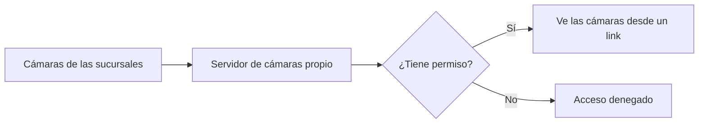

# Servidor de cámaras

**Estado:** En armado

## Resumen

Un servidor propio para ver las cámaras de las sucursales desde un link, con control de quién accede a qué. Hoy las cámaras ya se pueden ver, pero el acceso es muy limitado.

## Problema que resuelve

- El acceso actual a las cámaras es muy limitado: sólo algunas personas pueden verlas, y desde ciertos lugares.
- Dar acceso a alguien nuevo no es simple.
- Supervisar una sucursal depende de estar en un lugar o un equipo puntual.

## Objetivo

| Hoy | Objetivo |
|---|---|
| Las cámaras se pueden ver, pero el acceso es muy limitado | Se ven desde un link |
| Dar acceso a alguien nuevo no es simple | Se decide quién accede y a qué cámaras |
| Mirar una cámara depende de dónde estás | Se consultan desde donde haga falta |

## Cómo va a funcionar

1. Las cámaras de cada sucursal se conectan a un servidor que administramos nosotros.
2. Cada persona autorizada entra desde un link.
3. El servidor muestra sólo las cámaras que le corresponden.

## Por qué es mejor

- **Acceso simple:** un link en lugar de una configuración por persona.
- **Control de acceso:** cada persona ve sólo lo que le corresponde.
- **Más visibilidad:** se pueden supervisar las sucursales sin estar ahí.

## Próximos pasos

- Terminar el armado del servidor.
- Habilitar el acceso por link.
- Definir quién ve qué cámaras.
