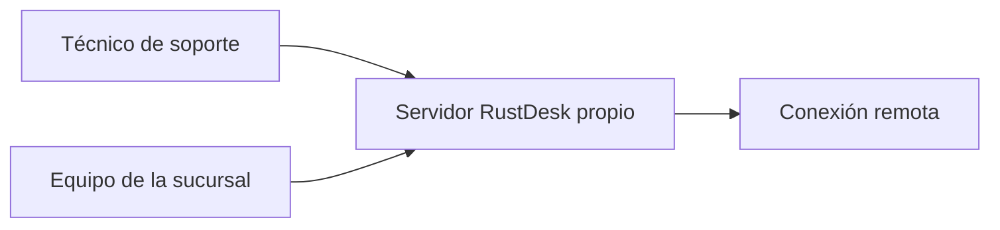

# Servidor propio de RustDesk

**Estado:** En instalación

## Resumen

Reemplazamos AnyDesk por un servidor propio de [RustDesk](https://rustdesk.com), una herramienta de acceso remoto de código abierto. El soporte técnico sigue conectándose a los equipos como siempre, pero las conexiones pasan por un servidor que gestionamos nosotros y no hay que pagar licencias.

## Problema que resuelve

- AnyDesk requiere pagar licencias.
- Las conexiones pasan por los servidores de un tercero.
- El control sobre los equipos se limita a lo que ofrece el proveedor.

## AnyDesk frente a RustDesk propio

| | AnyDesk | RustDesk propio |
|---|---|---|
| Licencias | Pago por licencia | Sin licenciamiento |
| Servidor | De un tercero | Propio, lo gestionamos nosotros |
| Control de los equipos | Limitado a lo que ofrece el proveedor | Vemos y administramos todos los equipos |
| Seguridad | Las conexiones pasan por un servicio externo | Las conexiones pasan por nuestro servidor |

## Cómo funciona

1. Instalamos el servidor de RustDesk en infraestructura propia.
2. Cada equipo de la empresa usa el cliente de RustDesk configurado contra ese servidor.
3. Soporte se conecta a los equipos a través de nuestro servidor, sin intermediarios externos.

## Por qué es mejor

- **Ahorro:** dejamos de pagar licencias de acceso remoto.
- **Control:** administramos todos los equipos desde nuestro propio servidor.
- **Seguridad:** las conexiones de soporte remoto no pasan por un servicio de terceros.

## Próximos pasos

- Terminar la instalación del servidor.
- Migrar los equipos de AnyDesk a RustDesk.
- Dar de baja las licencias de AnyDesk.
