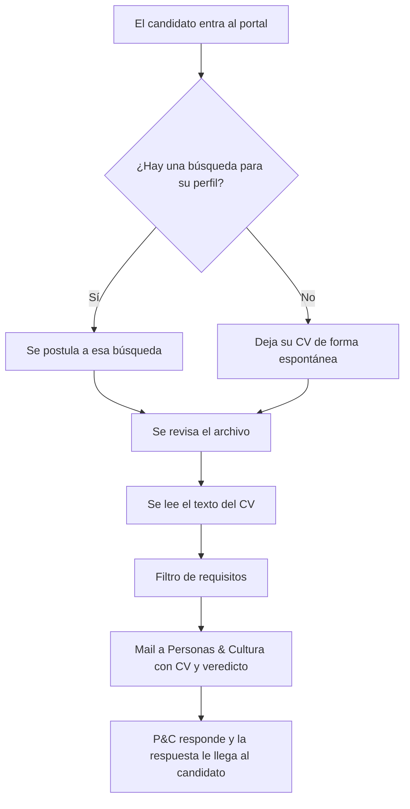

# Portal de postulaciones

**Estado:** Hecho, sin publicar

## Resumen

Una página pública de empleos donde cualquiera ve las búsquedas abiertas y deja su CV. Cada postulación pasa por un filtro de requisitos y le llega por mail a Personas & Cultura, con el CV adjunto y el resultado del filtro explicado. El desarrollo está hecho y probado. Para publicarlo falta configurar algunas cosas.

## Problema que resuelve

- Hoy los CV llegan por donde caiga: el WhatsApp de un encargado, en papel en el mostrador, una casilla personal. En el camino se pierden candidatos.
- Hay idas y vueltas para pedir el teléfono o saber para qué puesto era la postulación.
- Localiza Argentina no tiene una página propia de empleos.

## Qué es

- **Una web abierta.** Sin usuario ni contraseña, con dirección propia. El link se comparte en redes, en la firma del mail o en un QR en las sucursales.
- **Postulación en un paso.** El candidato adjunta el CV y completa nombre, mail, teléfono, localidad, área, LinkedIn y un mensaje. Puede elegir una búsqueda o dejar el CV para el futuro.
- **Llega a la casilla de siempre.** No hay sistemas nuevos ni otro tablero que revisar: cada postulación entra como un mail a la casilla que defina Personas & Cultura.

## El recorrido de una postulación

1. **Entra por el portal.** Elige una búsqueda abierta o se postula de forma espontánea.
2. **Se revisa el archivo.** Sólo PDF, DOC o DOCX, hasta 5 MB. Se verifica que el archivo sea lo que dice ser y se frenan los envíos automáticos de robots.
3. **Se lee el texto del CV.** El sistema abre el documento y extrae su contenido para compararlo.
4. **Pasa por el filtro.** Se compara con los requisitos cargados para esa búsqueda, excluyentes y deseables.
5. **Llega el mail a Personas & Cultura.** Con el CV adjunto, los datos del formulario y el detalle del filtro. Si P&C responde ese mail, la respuesta le llega directo al candidato.

## Cómo decide el filtro

Cada búsqueda tiene dos listas de requisitos:

- **Excluyentes:** si el CV no menciona alguno, la postulación queda marcada como «no pasa».
- **Deseables:** no bloquean nunca, sólo suman puntaje.

Cada requisito se carga con sus variantes ("registro de conducir", "licencia de conducir", "carnet de conducir") y alcanza con que aparezca una. No distingue mayúsculas ni acentos.

El puntaje va de 0 a 100: los excluyentes pesan 70 y los deseables, 30.

| Veredicto | Cuándo | Ejemplo de asunto del mail |
|---|---|---|
| Aprobado | Están todos los excluyentes. El puntaje ordena la lista | `[APROBADO (85/100)] Operador/a de Flota — Nombre Apellido` |
| No pasa | Falta algún excluyente, y el asunto dice cuál. **Llega igual:** el filtro ordena, no descarta | `[NO PASA — falta: registro de conducir] Operador/a de Flota — Nombre Apellido` |
| No legible | No se pudo leer el CV (un PDF escaneado, un .doc viejo o un archivo dañado). Va a revisión manual | `[CV NO LEGIBLE — revisar a mano] Ejecutivo/a Comercial — Nombre Apellido` |
| Sin filtro | Postulación espontánea: no hay contra qué comparar | `[Sin filtro (postulación espontánea)] — Nombre Apellido` |

Los requisitos no se publican en la web. Si el candidato los viera, los copiaría en el CV y el filtro dejaría de servir.

## Qué mejora para Personas & Cultura

- **No se pierden candidatos en el camino.** Todos los CV entran por el mismo lugar y con los mismos datos.
- **Menos idas y vueltas.** El CV llega con mail, teléfono, localidad y área ya cargados.
- **La bandeja se ordena sola.** El asunto adelanta el veredicto y la búsqueda, así que se puede priorizar sin abrir un archivo.
- **Llega filtrado.** Se rechazan los archivos que no son CV y los envíos automáticos.
- **Imagen de empleador.** Una página presentable, con la marca, los beneficios y el proceso explicado.
- **Menos consultas repetidas.** Las preguntas frecuentes están respondidas en la página.
- **Datos personales en regla.** El formulario aclara que la información se usa sólo para selección, según la Ley 25.326 de Protección de Datos Personales.

## Dos cosas que conviene saber

- **El mail es el registro.** Ningún CV se guarda en un sistema aparte: el mail con su adjunto es el único registro. Si más adelante hace falta un historial buscable, es un desarrollo nuevo.
- **Publicar una búsqueda todavía pasa por Sistemas.** Hoy las búsquedas se cargan en el código. El paso siguiente es un panel para que Personas & Cultura las dé de alta y de baja por su cuenta.

## Qué falta para ponerlo en marcha

- La casilla de correo que recibe los CV. Mientras no esté, el formulario avisa en pantalla que las postulaciones no están habilitadas, así que ninguna se pierde sin aviso.
- Dar de alta la dirección web propia, separada de la de la app interna.
- Que Personas & Cultura revise los requisitos reales de cada búsqueda. Hoy hay tres búsquedas de ejemplo.
